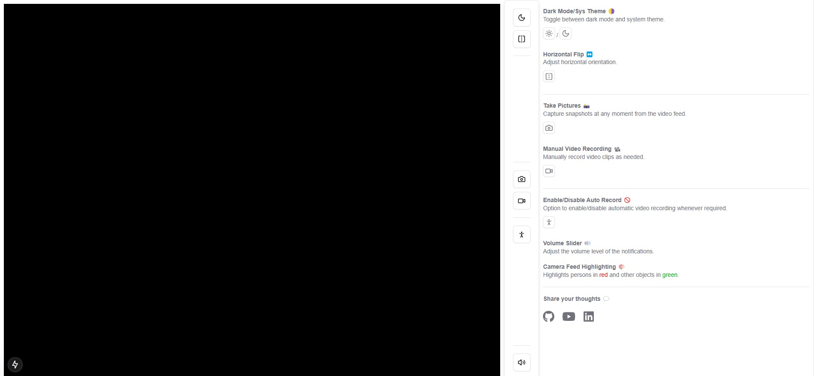

# 🎥 Webcam Object Detection and Video Recorder

An interactive and feature-rich React application that combines real-time object detection, video recording, and an intuitive user interface for a seamless user experience. Whether you're exploring AI capabilities or just want a fun project to interact with, this app has it all! 🚀

---



## ✨ Features

- **🔍 Real-Time Object Detection**: Utilizes TensorFlow.js's COCO-SSD model to detect objects in the webcam feed, highlighting:
  - 👤 People in **red**.
  - 🛠️ Other objects in **green**.
- **🎥 Video Recording**:
  - **Manual Recording**: Start and stop video recording with a single click.
  - **Auto-Recording**: Automatically starts recording when a person is detected.
- **📸 Snapshots**: Capture high-quality snapshots from the webcam feed and download them instantly.
- **🌗 Dark Mode & Theme Toggling**: Switch between a sleek dark mode and system theme.
- **🔊 Volume Control**: Fine-tune notification sounds with an adjustable volume slider.
- **↔️ Horizontal Flip**: Toggle the webcam feed orientation to suit your preference.
- **🎨 Enhanced Visuals**: Real-time annotations overlayed directly on the webcam feed.

---

## 🛠️ Technologies Used

- **Frontend**: React, TypeScript, Tailwind CSS
- **Object Detection**: TensorFlow.js (COCO-SSD model)
- **UI Components**: Radix UI, Lucide Icons
- **Utilities**:
  - React Webcam for webcam access.
  - React Loader Spinner for interactive loading indicators.
  - Sonner for modern toast notifications.

---

## 🚀 Getting Started

### Prerequisites

Ensure you have the following installed:

- **Node.js** (v16 or later)
- npm or yarn

### Installation Steps

1. **Clone the Repository**:

   ```bash
   git clone https://github.com/lvimuth/human-detection-web-app.git
   cd human-detection-web-app
   ```

2. **Install Dependencies**:

   ```bash
   npm install
   # or
   yarn install
   ```

3. **Start the Development Server**:

   ```bash
   npm run dev
   # or
   yarn dev
   ```

4. **Open in Browser**: Navigate to `http://localhost:3000` in your browser.

---

## 🎮 How to Use

1. **Start Webcam**: Grant camera permissions when prompted.
2. **Explore Features**:
   - **Object Detection**: Watch as objects are highlighted in real-time.
   - **Record Video**: Start/stop recording or let auto-recording detect and capture moments.
   - **Capture Snapshots**: Click the camera button to save snapshots to your device.
   - **Adjust Settings**: Experiment with dark mode, volume control, and feed flipping.

---

## 📂 Project Structure

```plaintext
src/
├── components/         # Reusable UI components
├── utils/              # Utility functions (e.g., canvas drawing, audio management)
├── pages/              # Main page components
├── styles/             # Tailwind CSS configuration
├── App.tsx             # Main app component
├── index.tsx           # Entry point
```

---

## 🔑 Key Functionalities

### 🕵️‍♂️ Object Detection

- Powered by TensorFlow.js, the COCO-SSD model detects objects in real-time.
- Highlights objects directly on the webcam feed with customizable visuals.

### 🎥 Video Recording

- **Manual Recording**: Users can control recording start/stop.
- **Auto-Recording**: Automatically triggers recording when a person is detected.

### 📸 Snapshots

- Capture moments directly from the video feed and download them with a single click.

### ⚙️ Additional Features

- **Dark Mode**: Matches your system theme for comfortable usage.
- **Volume Control**: Set the perfect volume for your environment.
- **Horizontal Flip**: Easily adjust the webcam feed to your preference.

---

## 🛑 Known Issues

- Auto-recording might trigger multiple times if multiple people are detected simultaneously.
- High CPU usage may occur on low-resource devices during intensive object detection.

---

## 🌟 Future Enhancements

- 🌐 **Custom Model Support**: Add flexibility by allowing users to load custom models.
- 🚀 **Performance Optimization**: Improve efficiency on low-end devices.
- ☁️ **Cloud Integration**: Enable cloud storage for snapshots and recordings.

---

## 🤝 Contributing

Contributions are always welcome! Feel free to:

- Fork this repository.
- Create a feature branch.
- Submit a pull request with your updates.

---

## 📜 License

This project is licensed under the MIT License. See the `LICENSE` file for more details.

---

## 🙌 Acknowledgments

A big thanks to the following:

- [TensorFlow.js](https://www.tensorflow.org/js) for their powerful object detection model.
- [React Webcam](https://www.npmjs.com/package/react-webcam) for seamless webcam integration.
- [Lucide Icons](https://lucide.dev/) for their beautiful icons.

---

## 📧 Contact

For questions or feedback, please reach out to [Lakshitha Vimuth](mailto:lvimuthfb@gmail.com).

---

### ⭐ Don't forget to star the repository if you find this project useful!
